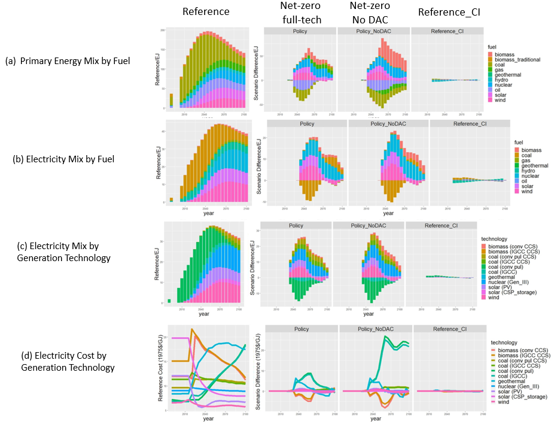

# Table of Contents
* [Introduction](#intro)
* [References](#refs)
* [Example Results](#example)

Introduction
--------------------------

This is the code base for a study on simulating energy-water-land co-evolution.

The numerical simulation is based on [GCAM model](https://gcims.pnnl.gov/modeling/gcam-global-change-analysis-model), while the python and R code in this repository has been used for data analysis and visualization, including spatiotemporal downscaling, sector- and technology-level resource usage breakdown, emission breakdown, etc.

The study considered the future impacts of China's net-zero cliamte policies and the physical environmental variables under various projected climate change scenarios.

Example Results
--------------------------

